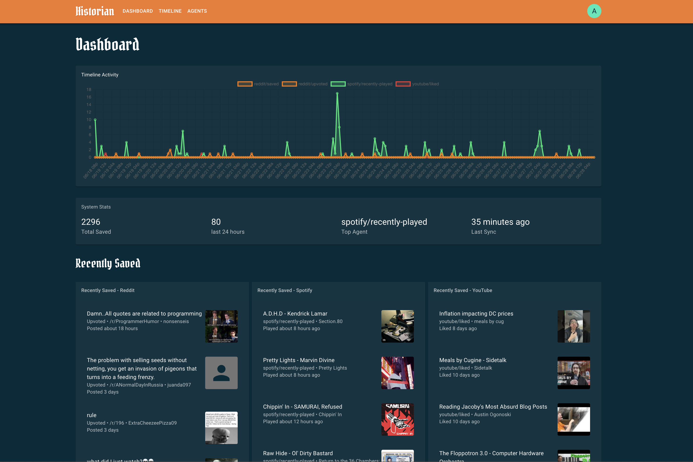
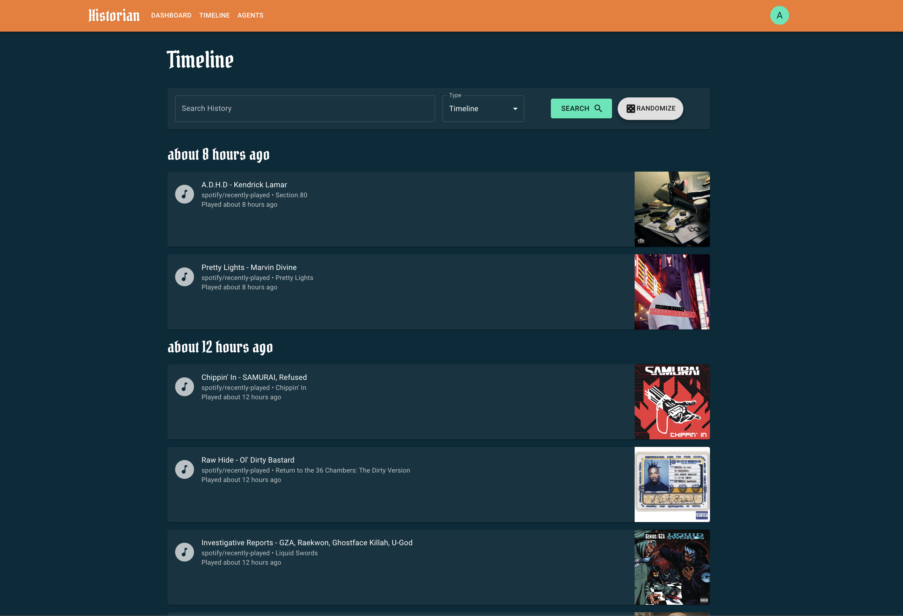
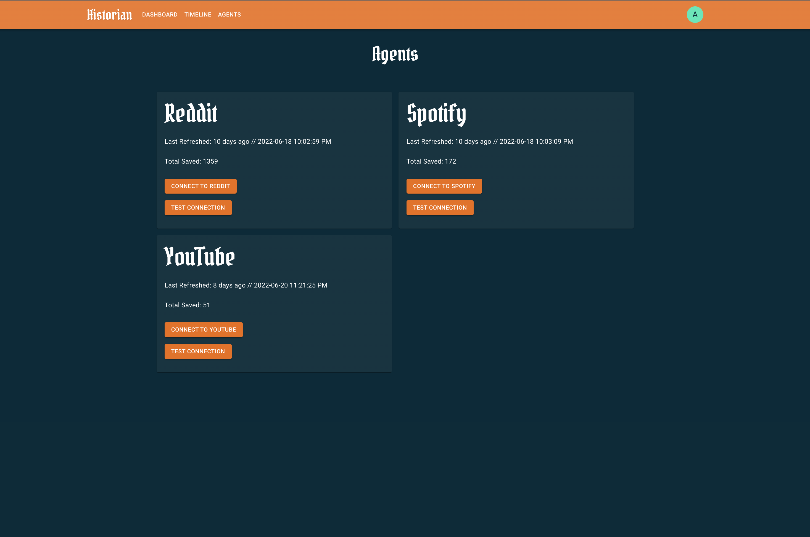

<h1 align="center">🕵️  Historian</h1>
<div align="center">
<em>#NeverForget</em> 
<br>
<br>
</div>



## About

Historian is an open-source app that gathers and archives your all your data from around the web.

Historian supports collecting data from the following services:

-   Reddit - Saved Posts, Upvoted Posts
-   Spotify - Liked Songs, Listening History
-   Instagram - Saved Posts, Likes Posts
-   YouTube - Liked Videos, Watch History

## Architecture

### Backend

The Backend is monolith Node.js Express web server that exposes REST APIs for the UI, Authentication, OAuth flows, as well as the collection service.

### Frontend

The Frontend is a Next.js web app that makes calls to the Backend.

## Getting Started

### Development

```bash
~/Dev/historian ❯ nvm install
~/Dev/historian ❯ npm install

# Backend Setup
~/Dev/historian/apps/backend ❯ npx prisma generate
~/Dev/historian/apps/backend ❯ npx prisma migrate dev

~/Dev/historian ❯ npm run backend:dev
~/Dev/historian ❯ npm run frontend:dev
```

## Cool Screenshots




