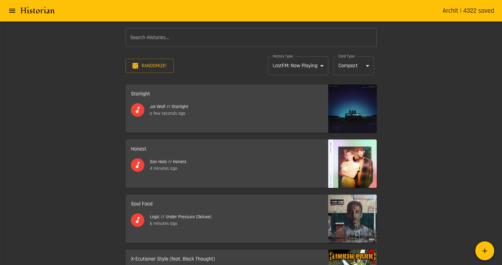

# 🕵️  Historian - Frontend

## About

</img>

The Historian Frontend serves allows users to interact with the Backend and visualize the data.

## Instructions

### Building

```bash
# Install the dependencies
yarn

# Start the server
yarn dev
```

### Deployment

Refer to `scripts/deploy.sh`